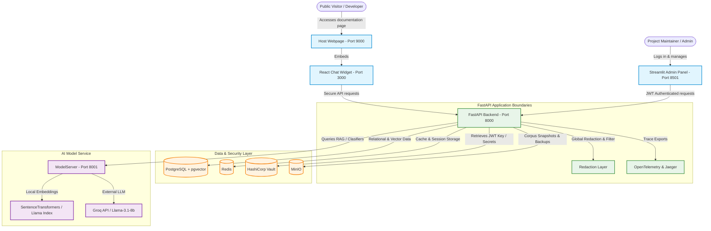

# System Architecture

This document describes the high-level architecture, service boundaries, and data flows of the **Maintainer's Copilot** project.

---

## System Diagram

The following Mermaid diagram visualizes the layout of the platform, detailing how the user-facing interfaces connect to our FastAPI service mesh, background microservices, and databases.



---

## ⚙️ Service Roles

### 1. Frontend & Client Interfaces
*   **Host Webpage (`demo/host/`)**: A static site served on port `9000` via Nginx representing a library documentation portal. It embeds the chat widget.
*   **React Widget (`widget/`)**: A lightweight, performant React application served on port `3000` (or bundled as static JS). It renders the floating chat bubble, streams chat conversations, and styles itself dynamically based on colors retrieved from the database.
*   **Streamlit Admin Panel (`chatbot/app.py`)**: An administrative control room served on port `8501` allowing maintainers to:
    *   Test agent chat conversations directly.
    *   Access the **Memory Inspector** to audit, filter, and delete episodic, semantic, or procedural memory vectors.
    *   Use the **Widget Configuration Manager** to perform CRUD operations on chat widgets (adjusting whitelisted domains, greeting messages, primary themes, and enabled tools).

### 2. FastAPI Backend Service (`app/`)
*   Serves on port `8000`. Acts as the central orchestrator for authentication (JWT), chat session creation, audit logging, and widget configuration storage.
*   **Refuse-to-Boot Lifecycle**: Validates database connectivity, Vault health, and MinIO bucket state synchronously during startup, refusing to run if credentials or storage components are unreachable.
*   **Security & Redaction Layer**: Intercepts all system output, structured logs, and OpenTelemetry spans to redact sensitive user data (OpenAI API keys, database URLs, emails, and passwords) before they hit log files or trace collectors.

### 3. ModelServer (`modelserver/`)
*   Serves on port `8001`. Wraps heavy model pipelines (issue classification, thread summarizers, entity extraction, and vector embedding calculation) away from the IO-bound FastAPI application to ensure optimal performance.
*   Uses local `SentenceTransformers` for fast, sparse/dense embedding queries, and interfaces with the LLM API (Groq) for final retrieval synthesis.

### 4. Infrastructure Layer
*   **PostgreSQL + `pgvector`**: Stores relational models (Users, Widgets, Conversations) and high-dimensional vectors for both corpus chunks (384-dim) and long-term user memories (768-dim).
*   **HashiCorp Vault**: Securely stores encryption keys, database credentials, and signing secrets.
*   **Redis**: Manages rate-limiting counters, caching layers, and transient session states.
*   **MinIO**: Serves as the object storage server for raw corpus backups and processed parquet datasets.

---

## 🔄 Core Data Flows

### A. RAG Retrieval & Tool-Calling Flow
```
User Message -> React Widget -> FastAPI Backend -> ModelServer 
                                                     |
  +--------------------------------------------------+
  | (LLM reasons and decides to call tools)
  v
[Tool Executions]
  * search_knowledge_base -> Hybrid Search (pgvector + sparse) -> RRF Fusion
  * classify_issue        -> ModelServer XGBoost/TF model
  * extract_entities      -> LLM/regex extractor
  * summarize_thread      -> LLM summarization
  * write_memory          -> Inserts memory vector to PostgreSQL
  |
  +-> Synthesized Answer -> Markdown Stream -> FastAPI -> React Widget
```

### B. Trace & Log Redaction Flow
```
FastAPI / ModelServer Execution -> Emit OpenTelemetry Spans & Logs
                                             |
                                    [Redaction Processor]
                                             |
                 (Checks for API keys, passwords, credentials)
                                             |
                                             v
                           Filtered Export -> Jaeger / api.log
```
