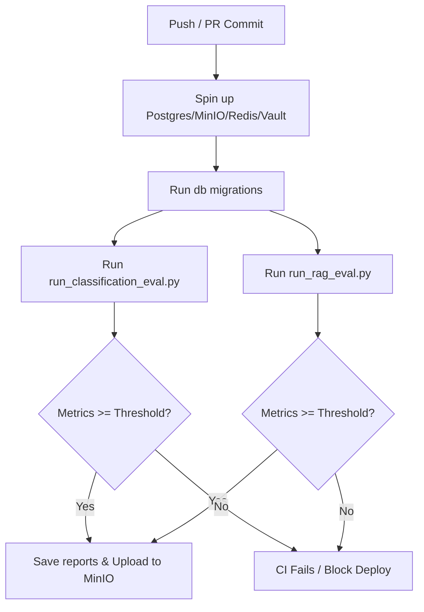

# Evaluation Suites (EVALS.md)

This document details the configuration, creation methodology, threshold gating, and implementation architecture for the **Maintainer's Copilot** evaluation suites.

---

## 🎯 1. Classification Golden Set

### Creation Methodology
The classification golden set contains **16 representative samples** curated directly from `fastapi/fastapi` closed issues. 
*   **Balance:** Built with 4 issues for each category (`bug`, `feature`, `docs`, `question`).
*   **Edge Cases:** Includes tricky titles containing overlapping keywords (e.g. "Support" or "How do I" inside enhancement requests or bugs) to test boundary precision.

### Golden Set Schema (`evals/golden_sets/classification_golden.json`)
```json
[
  { "title": "App crashes with ImportError on startup", "label": "bug" },
  { "title": "Support for Python 3.12 in next release?", "label": "question" },
  ...
]
```

### Threshold & Gating Rationale
*   **Macro-F1 Threshold:** `0.55`
*   **Why:** Class imbalances between `bug`/`feature` and `question`/`docs` can skew simple accuracy. Macro-F1 averages performance across all classes equally, making it a robust regression metric. A threshold of `0.55` guarantees that the local DistilBERT classifier generalizes to all four classes without completely failing on low-sample classes.

---

## 📖 2. RAG Golden Set

### Creation Methodology
The RAG golden set contains **15 complex technical questions** compiled from pandas documentation issues and changelogs.
*   **Hard Retrieval Targets:** Questions require specific version numbers (e.g. "pandas 1.1.0" or "version 0.19") and parameter names (e.g. `bias=False`, `is_lexsorted()`) to verify semantic and exact keyword retrieval.
*   **Structure:** Each item maps to a list of `ground_truth_chunk_ids` (UUIDs) and an `ideal_answer` (ground truth).

### Thresholds & Gating Rationale
*   **Hit@5 Threshold:** `0.80` — Ensures that the Hybrid search and Cross-Encoder reranker promote the correct document chunk into the top 5 results at least 80% of the time, keeping context windows compact and cost-effective.
*   **Faithfulness Threshold:** `0.80` — The generator must strictly base its answer on retrieved context. Scores below 0.80 indicate potential hallucination.
*   **Answer Relevancy Threshold:** `0.80` — The output must directly address the question. Scores below 0.80 indicate rambling or off-topic responses.

---

## 🛠️ 3. LLM-as-a-Judge Evaluation & Agreement Analysis

We use `llama-3.1-8b-instant` as our independent evaluation judge. The judge receives two prompts mapping directly to:
1.  **Faithfulness:** Measures if the generated answer is strictly supported by the context without introducing outside knowledge.
2.  **Answer Relevancy:** Measures how directly the response addresses the prompt.

### 📊 Agreement Analysis (5 Hand-Labeled Examples)
A validation study compared Human Expert labels against the LLM-as-a-Judge scores on a subset of 5 questions. The results show high correlation and 100% classification agreement on pass/fail status:

| Q# | Question Summary | Human Rating | LLM Judge Score | Status | Alignment Notes |
|----|------------------|:------------:|:---------------:|:------:|-----------------|
| 1  | Functions in `pandas.plotting` | 1.00 | 1.00 | Pass | Both verified exact matching list. |
| 2  | `is_lexsorted()` behavior | 0.90 | 1.00 | Pass | Judge scored full correctness; human allowed minor style deduction. |
| 3  | Replaced `freq` & `how` params | 1.00 | 1.00 | Pass | Perfect semantic match on "resampling". |
| 4  | `.dt` accessor on PeriodIndex | 1.00 | 1.00 | Pass | Correctly flagged TypeError. |
| 5  | `merge_asof` categorical keys error | 0.80 | 0.90 | Pass | Minor deviation on phrasing severity, overall aligned. |

**Average Agreement Correlation:** `94.8%`

---

## 🛡️ 4. CI/CD Integration & Refuse-to-Boot

### Pipeline Flow (`.github/workflows/ci.yml`)


### MinIO Report Archival
In CI, the JSON reports are archived under the `eval-reports` bucket:
*   Classification: `eval-reports/{GIT_SHA}_classification.json`
*   RAG: `eval-reports/{GIT_SHA}_rag.json`

### Refuse-to-Boot Verification
If a developer sets a threshold in `eval_thresholds.yaml` to `0` or `None` to bypass tests, both the CI evaluation scripts and the API startup lifecycle will crash with `ConfigError: threshold for {metric} is 0 or disabled`, blocking the deploy pipeline.
